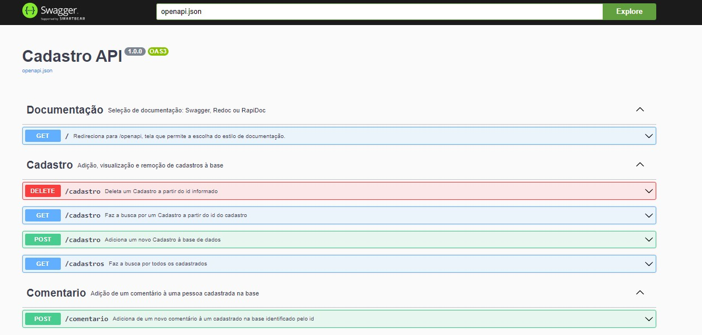
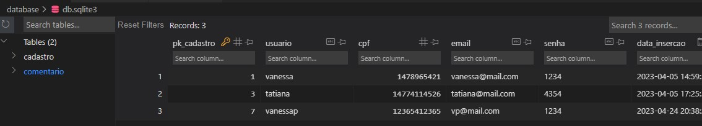

# Cadastro - API

Este projeto referente ao Desenvolvimento MVP - Sprint 1 - Pós graduação em Engenharia de Software da PUC Rio. 

O objetivo aqui é ilutsrar um cadastro de usuários, interagindo atráves das tecnologias Python, SQLite, Swagger(API). 

## Como executar

Será necessário ter todas as libs python listadas no requirements.txt instaladas. Após clonar o repositório, é necessário ir ao diretório raiz, pelo terminal, para poder executar os comandos descritos abaixo.

(env)$ pip install -r requirements.txt

Este comando instala as dependências/bibliotecas, descritas no arquivo requirements.txt.

Para executar a API basta executar:

(env)$ flask run --host 0.0.0.0 --port 5000

Em modo de desenvolvimento é recomendado executar utilizando o parâmetro reload, que reiniciará o servidor automaticamente após uma mudança no código fonte.

(env)$ flask run --host 0.0.0.0 --port 5000 --reload

Abra o http://localhost:5000/#/ no navegador para verificar o status da API em execução.

## Principais Insights:

Apresentação do Swagger com todas as rotas apresentadas:

Interação com o banco de dados:

